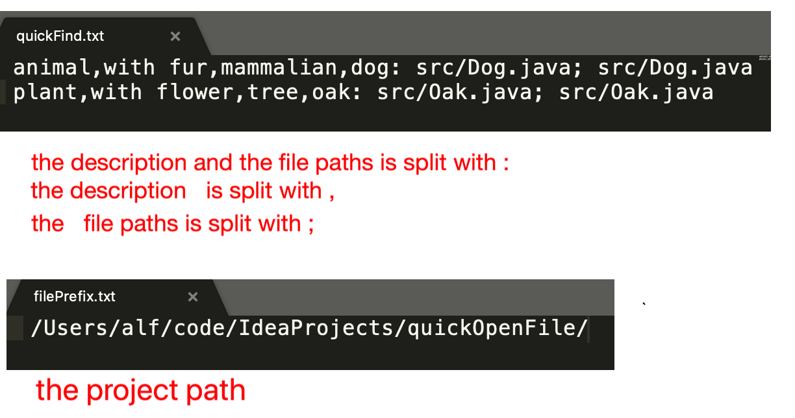
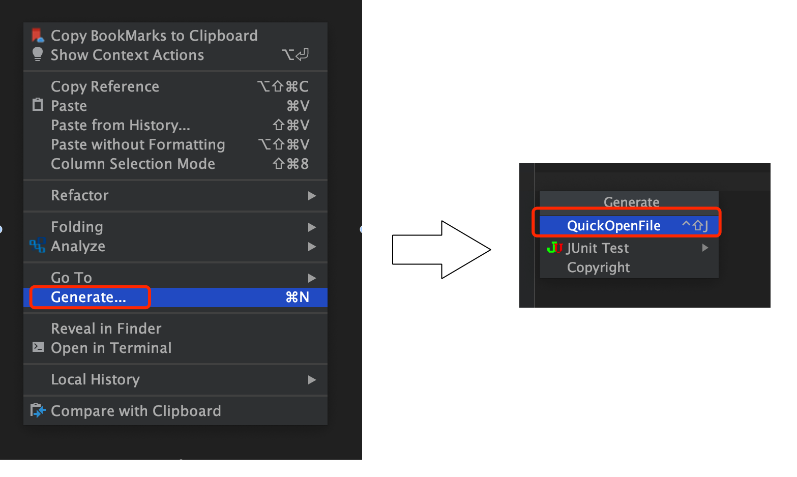
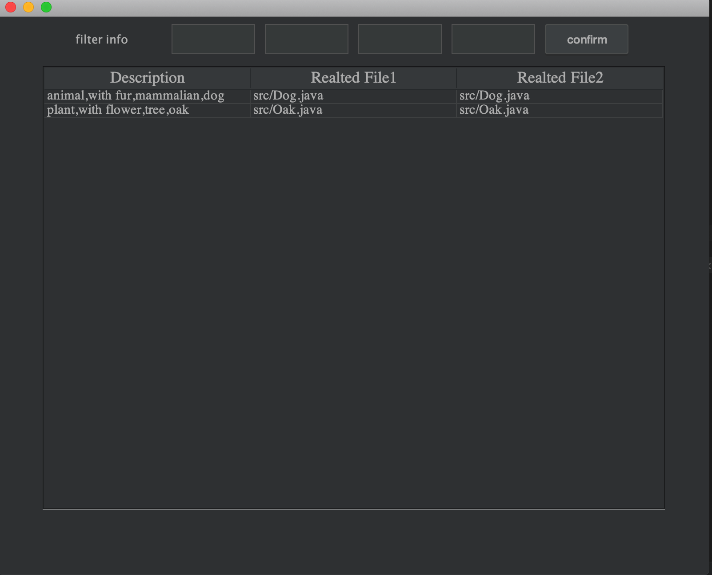
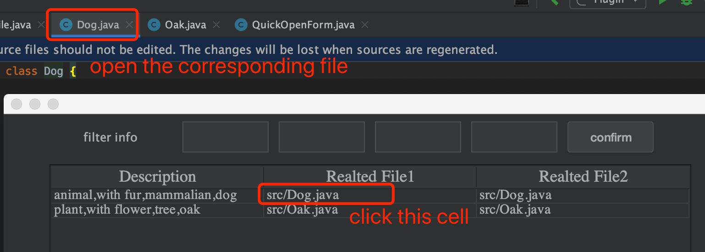
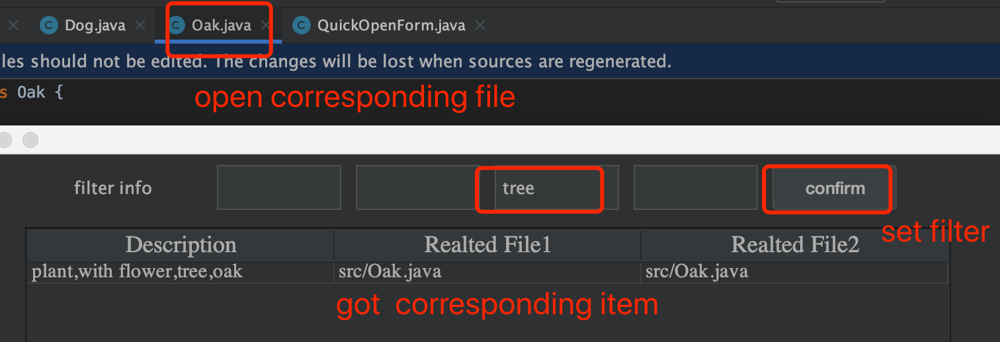
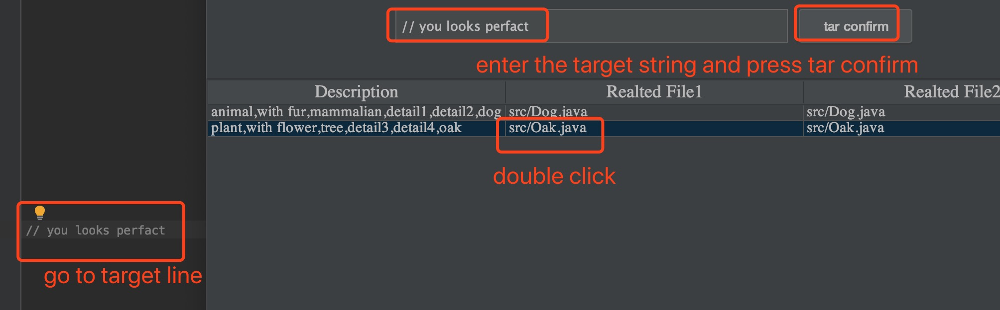

## purpose 

This is a qucik file open pligins on IDEA that help you open files quickly without remember the name of the file but only the function or the description of it.

## usage 

install the "QuickOpenFile" plugins  in IDEA, and  copy the  "IDEAConfig" folder under you home directory, after that, modify the first line of   filePrefix.txt  to your project  path. and config quickFind.txt with the deccription  and the relative path to project path   of the file you want to open. just like:

  

 

Then, in IDEA open this interface, go to the main menu（the hot key to open the main menu is fixed to "control alt G", under mac it's "command alt G"）.
 

  

  

 

Double click the file you want to open, and then it will appear in the  editor.  
 

  

 

If you have too much file items , you can search with filters, for example, fill "tree" in the text feild and click "confirm" button, you can got the  specific item you want.  This is very useful when you are dealing with many complex file.

  

### go to target line 

 Fill the target string in the  text feild, and click "tar confirm" button,  when you double click the related file, it will go to the line number of  target line if the line contains the target line. 

  

# welcome to join 
 
 If you are interested, welcome to join me.
 
Enjoy it.
